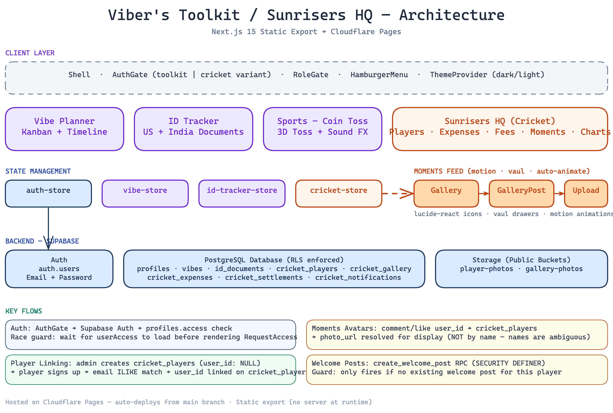

# Viber's Toolkit

A personal productivity suite — fast, private, and self-hosted.

[](LICENSE)
[](https://pages.cloudflare.com)
[](https://nextjs.org)

## Tools

| Tool | Description |
|------|-------------|
| **Vibe Planner** | Kanban board + timeline with drag & drop, due dates, notes, categories |
| **Sports — Coin Toss** | 3D cricket coin toss with sound effects, ICC standard fair randomness |
| **ID Tracker** | Track US & India identity documents for family, expiry reminders, renewal links |
| **Admin Dashboard** | User management, activity stats, enable/disable users, set limits |

## Architecture



## Tech Stack

- **Framework** — [Next.js 15](https://nextjs.org) (App Router, static export)
- **Language** — TypeScript
- **Styling** — [Tailwind CSS v4](https://tailwindcss.com) with CSS custom properties
- **State** — [Zustand](https://zustand-demo.pmnd.rs)
- **Icons** — [Lucide React](https://lucide.dev), [React Icons](https://react-icons.github.io/react-icons/)
- **Design System** — [CVA](https://cva.style) + [Radix UI](https://radix-ui.com) + shadcn/ui pattern
- **Toasts** — [Sonner](https://sonner.emilkowal.ski) (lightweight notifications)
- **Animations** — [Motion](https://motion.dev) (gestures, spring physics), [@formkit/auto-animate](https://auto-animate.formkit.com) (list transitions)
- **Bottom Sheets** — [Vaul](https://vaul.emilkowal.ski) (iOS-style draggable drawers)
- **Drag & Drop** — [@dnd-kit](https://dndkit.com)
- **Auth & Database** — [Supabase](https://supabase.com) (PostgreSQL + Auth + RLS)
- **Hosting** — [Cloudflare Pages](https://pages.cloudflare.com) (static export)
- **Theme** — [next-themes](https://github.com/pacocoursey/next-themes) (dark/light)

## Project Structure

```
vibers-toolkit/
├── app/
│   ├── layout.tsx                    # Root layout: theme, shell, metadata
│   ├── page.tsx                      # Redirects to /vibe-planner
│   ├── globals.css                   # Tailwind + dark/light theme variables
│   ├── providers.tsx                 # ThemeProvider + Toaster
│   └── (tools)/
│       ├── vibe-planner/             # Vibe Planner
│       │   ├── page.tsx
│       │   ├── components/           # Board, Timeline, VibeCard, Header, etc.
│       │   └── lib/                  # Constants, utils
│       ├── sports/toss/              # Cricket Coin Toss
│       │   └── page.tsx
│       ├── id-tracker/              # ID Tracker
│       │   ├── page.tsx
│       │   └── lib/                 # constants, utils
│       └── admin/                    # Admin Dashboard
│           └── page.tsx
├── components/                       # Shared: Shell, AuthGate, HamburgerMenu, etc.
│   └── ui/                          # Design system: Button, Input, Dialog, Alert, Card, etc.
├── lib/                              # Supabase client, auth helpers, storage, nav, utils, brand
├── stores/                           # Zustand stores (auth-store, vibe-store, id-tracker-store)
├── types/                            # TypeScript types
├── tests/                            # Playwright E2E tests
├── public/                           # Static assets (hero.png, toss.png)
├── docs/
│   ├── SUPABASE_SETUP.md            # Setup guide
│   └── DATABASE_SCHEMA.sql          # Complete DB schema with comments
├── .env.example                      # Template for env vars
└── .env.local                        # GITIGNORED — real credentials
```

## Quick Start

### Local Development

```bash
git clone https://github.com/BhaskarMantralaHub/vibe-planner.git
cd vibe-planner
npm install
cp .env.example .env.local  # Add your Supabase credentials
npm run dev                  # http://localhost:3000
```

### Build for Production

```bash
npm run build    # Generates static export in out/
npx serve out    # Preview locally
```

### Deploy to Cloudflare Pages

1. Push to GitHub `main` branch
2. Cloudflare Pages auto-deploys with:
   - **Build command**: `npm run build`
   - **Output directory**: `out`
3. Add environment variables (see [Supabase Setup](./docs/SUPABASE_SETUP.md))

### Set Up Supabase

See [docs/SUPABASE_SETUP.md](./docs/SUPABASE_SETUP.md) — run [DATABASE_SCHEMA.sql](./docs/DATABASE_SCHEMA.sql) to create everything in one go.

## Features

### Vibe Planner
- **Board view** — 4-column kanban (Spark → In Progress → Scheduled → Done)
- **Timeline view** — Weekly calendar with unscheduled vibes section
- **Due dates** — Color-coded: red (overdue), orange (≤3 days), green (future). Click to edit.
- **Notes** — Add URLs, justifications, context. Links are auto-clickable.
- **Categories** — Work, Personal, Creative, Learning, Health with filter pills and counts
- **Soft delete** — Recently Deleted with restore, synced across devices via `deleted_at` column
- **Inline edit** — Double-click to edit vibe text, click to expand notes
- **Completed date** — Shows "✓ Completed Mar 13" when done
- **Mobile** — Bottom sheet menus, tap ⋮ for options
- **Desktop** — Drag & drop between columns, right-click menus

### Sports — Coin Toss
- **3D coin flip** — Bronze (Heads) and Silver (Tails) with realistic animation
- **Sound effects** — Metallic spinning + landing clink via Web Audio API
- **Idle spin** — Coin rotates showing both sides before first toss (no bias)
- **History** — Last 20 tosses with H/T count
- **Cryptographic randomness** — `crypto.getRandomValues()` for true 50/50 fairness
- **Fair Play notice** — Expandable disclaimer

### Admin Dashboard (admin only)
- **User list** — All enrolled users with name, email, join date, activity stats
- **Matrix filters** — All, Admins, Users, Flagged, Disabled with visual cards
- **Search** — Filter by name or email
- **Pagination** — 5 users per page
- **Recently joined** — Top 3 newest users with activity breakdown
- **Suspicious user flagging** — Auto-detects disposable emails, unusual names, missing info
- **Accept / Reject** — Super admin can accept flagged users or reject (delete) them
- **Enable / Disable users** — Disabled users can't log in, shown "account disabled" message
- **Make / Revoke admin** — Super admin only, via ⋮ menu
- **User capacity** — Visual progress bar with editable limit (stored in DB, no deploy needed)
- **Super admin** — Cannot be revoked, configured via `NEXT_PUBLIC_SUPER_ADMIN_EMAIL`

### ID Tracker
- **US documents** — Passport, Driver's License, Green Card, EAD, H1B/H4 Visa, Travel Document, State ID, SSN, Global Entry, TSA PreCheck
- **India documents** — Passport, Aadhaar, PAN Card, Driver's License, Voter ID, OCI Card
- **Custom types** — Other (US) and Other (India) for anything not listed
- **Family support** — Track documents per person (owner_name field), filter by person
- **Expiry tracking** — Color-coded urgency: expired (red), critical <=30 days (orange), warning <=90 days (yellow), safe (green)
- **Reminders** — Configurable reminder days (default: 90, 30, 7 days before expiry)
- **Renewal links** — Pre-filled official renewal URLs for each document type
- **Local + cloud** — Works offline via localStorage, syncs to Supabase when logged in

### Auth & Security
- Email/password login with Supabase Auth
- Signup with dynamic max user limit (editable from admin dashboard)
- Forgot password / reset password flow
- Row Level Security — each user sees only their own data
- Disabled user check on login AND session load
- Rate limiting on auth attempts
- Sanitized error messages (no information leaks)
- `is_admin()` SECURITY DEFINER function for safe RLS checks

### Database
- **4 tables**: `vibes`, `profiles`, `app_settings`, `id_documents`
- **4 functions**: `is_admin()`, `get_user_count()`, `handle_new_user()`, `update_updated_at()`
- **Auto-profile creation** on signup via trigger
- **Soft delete** with `deleted_at` column
- **Auto `updated_at`** via trigger
- Full schema: [docs/DATABASE_SCHEMA.sql](./docs/DATABASE_SCHEMA.sql)

## Environment Variables

| Variable | Purpose |
|----------|---------|
| `NEXT_PUBLIC_SUPABASE_URL` | Supabase project URL |
| `NEXT_PUBLIC_SUPABASE_ANON_KEY` | Supabase anon key |
| `NEXT_PUBLIC_SUPER_ADMIN_EMAIL` | Super admin email (can't be revoked) |

> `NEXT_PUBLIC_MAX_USERS` is no longer needed — the limit is stored in the `app_settings` DB table and editable from the admin dashboard.

## Running Tests

```bash
npm run dev  # Start dev server first

# In another terminal
TEST_EMAIL=you@example.com TEST_PASSWORD=yourpass node tests/smoke.mjs
TEST_EMAIL=you@example.com TEST_PASSWORD=yourpass node tests/e2e.mjs
```

## License

[MIT](./LICENSE)
